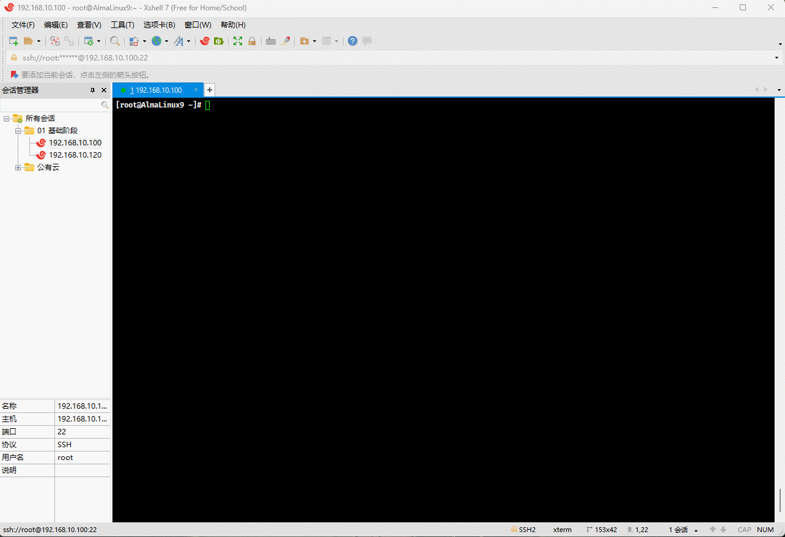
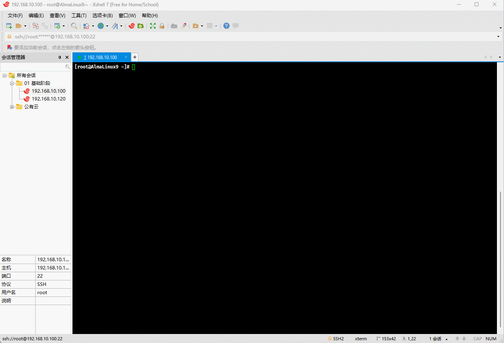
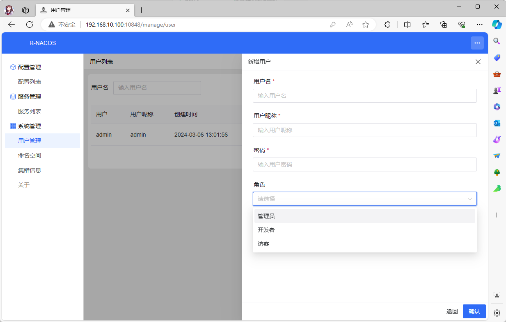
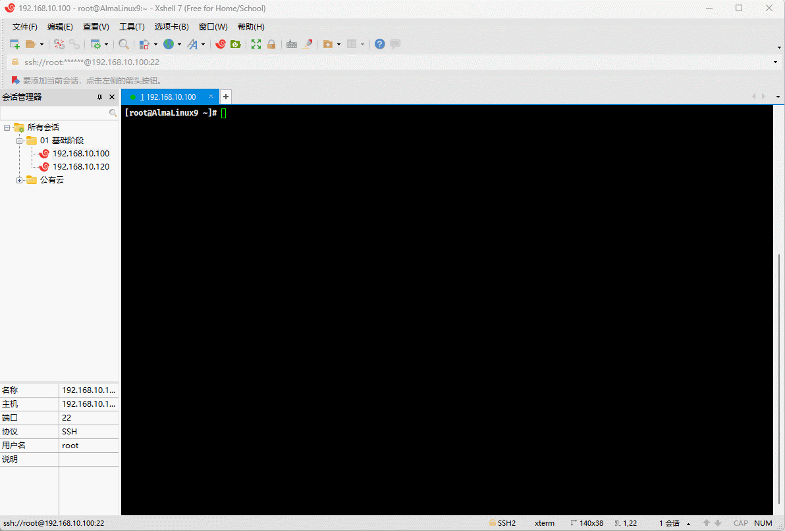
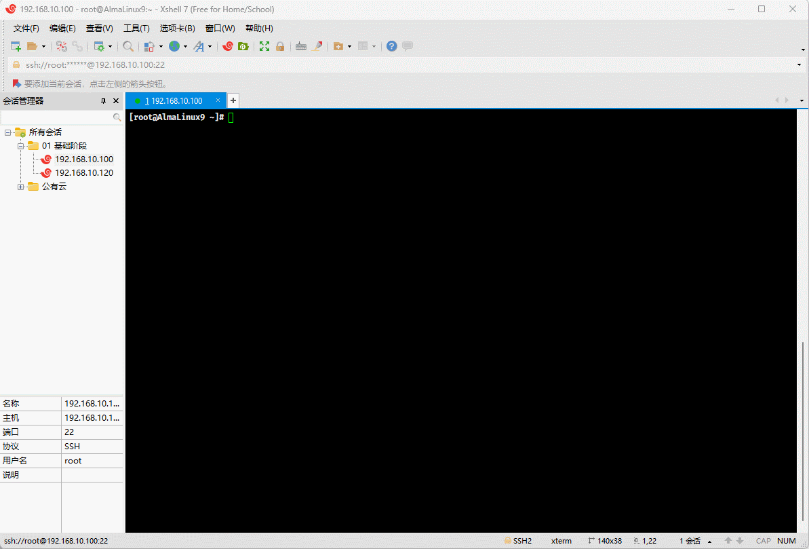
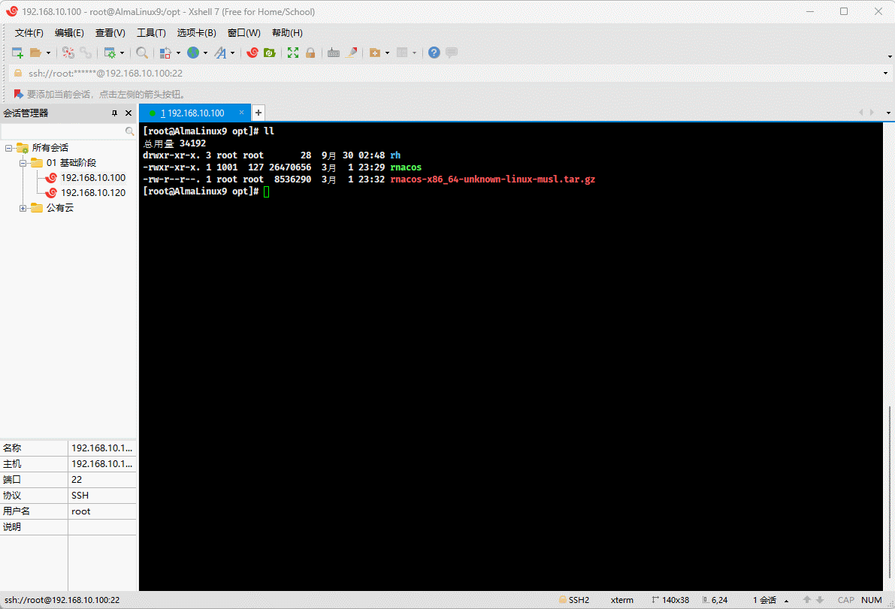
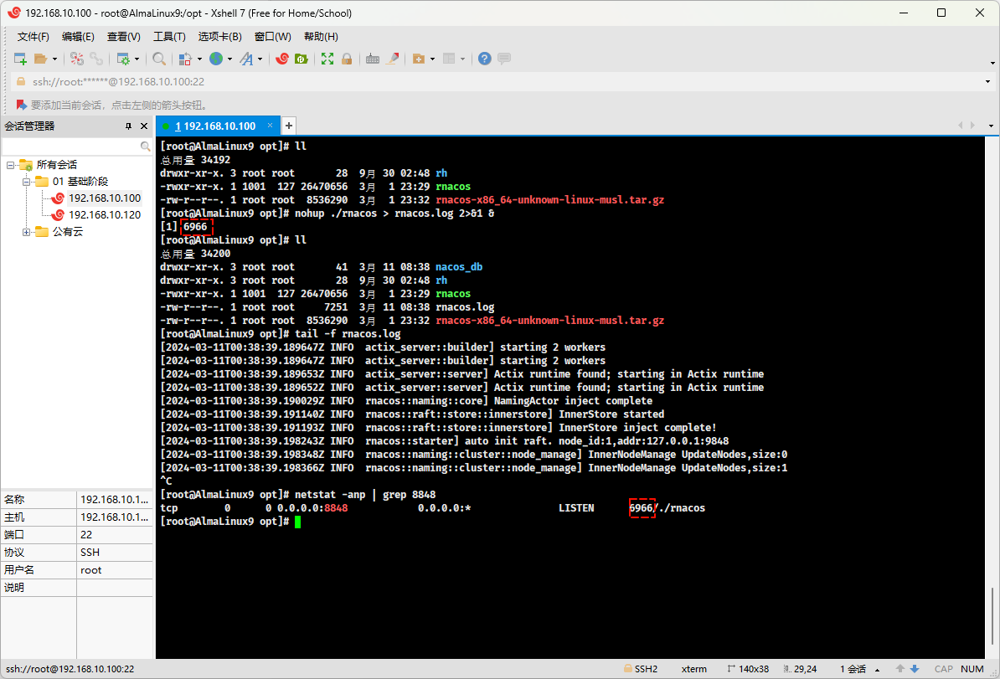

# 第一章：Docker 安装和运行

## 1.1 准备工作

* 查看 Linux 操作系统的发行版：

```shell
cat /etc/os-release
```


* 查看内核版本：

```shell
uname -sr
```


* 关闭 SELinux ：

```shell
# 查看 SELinux 是否开启
getenforce
# 查看 SELinux 是否开启
cat /etc/selinux/config
# 永久关闭 SELinux ，需要重启
sed -i 's/enforcing/disabled/' /etc/selinux/config
# 关闭当前会话的 SELinux ，重启之后无效
setenforce 0
# 查看 SELinux 是否开启
cat /etc/selinux/config
```


* 关闭 swap 分区：

```shell
# 查看 swap 分区是否存在
free -h
# 关闭当前会话的 swap ，重启之后无效
swapoff -a
# 永久关闭 swap ，需要重启
sed -ri 's/.*swap.*/#&/' /etc/fstab
# 查看 swap 分区是否存在
free -h
```



* 关闭防火墙：

```shell
systemctl disable --now firewalld
```


## 1.2 Docker 安装

* 增加 Docker 源：

```shell
sudo dnf config-manager --add-repo https://download.docker.com/linux/centos/docker-ce.repo
```



* 安装 Docker ：

```shell
sudo dnf -y install docker-ce docker-ce-cli containerd.io docker-compose-plugin
```


* 启动 Docker ：

```shell
sudo systemctl --now enable docker
```


* 查看 Docker 是否安装成功：

```shell
docker version
```


* 阿里云镜像加速：

```shell
sudo mkdir -pv /etc/docker
```

```shell
tee /etc/docker/daemon.json <<-'EOF'
{
  "exec-opts": ["native.cgroupdriver=systemd"],	
  "registry-mirrors": [
    "https://du3ia00u.mirror.aliyuncs.com",
    "https://docker.m.daocloud.io",
    "https://hub-mirror.c.163.com",
    "https://mirror.baidubce.com",
    "https://docker.nju.edu.cn",
    "https://docker.mirrors.sjtug.sjtu.edu.cn"
  ],
  "live-restore": true,
  "log-driver":"json-file",
  "log-opts": {"max-size":"500m", "max-file":"3"},
  "max-concurrent-downloads": 10,
  "max-concurrent-uploads": 5,
  "storage-driver": "overlay2"
}
EOF
```

```shell
sudo systemctl daemon-reload
```

```shell
sudo systemctl restart docker
```


## 1.3 Docker 运行

* Docker 运行命令：

```shell
docker run -d --name nacos \
	-p 8848:8848 \
	-p 9848:9848 \
	-p 10848:10848 \
	-v /var/nacos/io:/io:rw \
	qingpan/rnacos:stable
```

> 注意⚠️：stable 是最新正式版本号，也可以指定镜像版本号，如： `qingpan/rnacos:v0.4.0`。


* Docker 镜像版本说明：

| Docker 镜像版本 | tag 格式          | 示例                         | 备注                                                         |
| --------------- | ----------------- | ---------------------------- | ------------------------------------------------------------ |
| gnu debian包    | `$version`        | qingpan/rnacos:v0.4.0        | 基于 debian-slim，体积比较大(压缩包 36M，解压后102M)，运行性能相对较高。 |
| musl alpine包   | `$version-alpine` | qingpan/rnacos:v0.4.0-alpine | 基于 alpine，体积比较小(压缩包 11M，解压后34M)，运行性能相对较低。 |

> 注意⚠️：如果不关心版本，可以使用最新正式版本 tag
>
> * ① 最新的 gnu 正式版本：`qingpan/rnacos:stable`。
> * ② 最新的 alpine 正式版本: `qingpan/rnacos:stable-alpine`。
> * ③ 目前 MacOS arm 系统运行`stable`镜像失败，可以先换成`stable-alpine`镜像，等后面解决arm `stable`镜像问题后再把这个注意事项去掉。

## 1.4 Docker Compose 运行

* 编写 docker-compose.yaml 文件：

```shell
vim docker-compose.yaml
```

```yaml
version: '3.8'

services:
  nacos:
    image: qingpan/rnacos:stable
    container_name: nacos
    ports:
      - "8848:8848"
      - "9848:9848"
      - "10848:10848"
    volumes:
      - /var/nacos/io:/io:rw
    restart: always
```


* 运行：

```shell
docker compose up -d 
```


## 1.5 使用 R-Nacos 控制台

### 1.5.1 访问

* 服务启动后，可以在浏览器通过 `http://192.168.10.100:8848` 来进行访问老控制台：


> 注意⚠️：`8848`端口属于老的控制台，不需要登录，也不支持用户管理，未来可能被废弃！！！

* 服务启动后，可以在浏览器通过 `http://192.168.10.100:10848` 来进行访问新控制台：


> 注意⚠️：
>
> * ① 默认的用户名和密码是 `admin`/`admin` 。
>
> * ②`10848`端口属于新的控制台，有完备的用户管理、登陆校验、权限控制，支持对外网暴露。

* 此时，可以登录进去查看一下：


### 1.5.2 用户管理

* 用户管理的角色如下：



> 注意⚠️：对外暴露的 Nacos 控制台端口前，建议增加一个自定义管理员，把 admin 用户删除或禁用，默认的角色如下：
>
> * 管理员：所有控制台权限。
> * 开发者：除了用户管理的所有控制台权限。
> * 访客：只能查询配置中心与注册中心的数据，没有编辑权限。

* 可以新增几个用户，测试一下：


### 1.5.3 配置管理

* 配置列表管理：


* 配置编辑：


### 1.5.4 服务管理

* 服务列表管理：


* 服务实例管理：


### 1.5.5 命名空间管理

* 命名空间列表：


# 第二章：源码安装

## 2.1 Linux 或 Mac 安装和运行

### 2.1.1 概述

* （对于 Linux 或 Mac  只需要从 [github](https://github.com/r-nacos/r-nacos/releases) 下载对应的软件包，解压后即可运行）。

### 2.1.2 安装

* 下载：

```
wget -P /opt https://github.com/r-nacos/r-nacos/releases/download/v0.4.3/rnacos-x86_64-unknown-linux-musl.tar.gz
```



* 解压：

```shell
cd /opt
```

```shell
tar -xvf rnacos-x86_64-unknown-linux-musl.tar.gz
```



### 2.1.3 前台运行

* 命令：

```shell
./rnacos
```



### 2.1.4 后台运行

* 后台运行：

```shell
nohup ./rnacos > rnacos.log 2>&1 &
```


* 查看指定的进程：

```shell
# 8848 或 10848
netstat -anp | grep 8848
```



## 2.2 Win 安装和运行

* 解压直接运行 rnacos.exe 即可：略。

