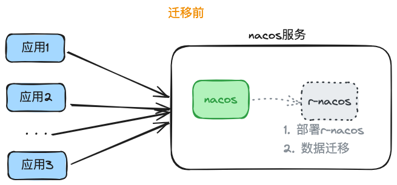
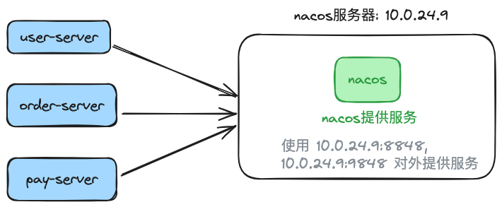

## 1. 引言


很多同学了解 r-nacos 特性后最开始只将 r-nacos 用于开发测试环境。

经过一段时间的使用后，部分同学有打算生产环境也从 nacos 迁移到r-nacos 。

一些之前使用 nacos 服务的同学了解 r-nacos 后打算从 nacos 迁移到 r-nacos。

那么如何平衡地从 nacos 迁移到 r-nacos 呢？


> [!NOTE]
>
> [r-nacos](https://github.com/nacos-group/r-nacos) 简介：
>
> * ① r-nacos 是一个用 rust 实现的 nacos 服务。相较于 java nacos 来说，是一个提供相同功能，启动更快、占用系统资源更小（初始内存小于 10 M）、性能更高、运行更稳定的服务。
>
> * ② r-nacos 设计上完全兼容最新版本 nacos 面向 client sdk 的协议（包含 1.x 的 http OpenApi，和 2.x 的 grpc 协议）, 支持使用 nacos 服务的应用平迁到 r-nacos 。 

## 2. 迁移计划


### 2.1 待迁移内容分析

迁移的目标已明确，在设计迁移计划前，我们需要先分析待迁移的数据。


从nacos迁移到r-nacos主要涉及4类数据：
1. nacos鉴权用户数据
2. 命名空间数据
3. 配置数据 
4. 服务实例数据

nacos用户数据、命名空间数据与配置数据是持久化数据，需要事先完成设置与迁移。
服务实例数据是动态数据，切换后应该会自动注册，不需要事先迁移。

### 2.2 迁移阶段与步骤

我们可以把迁移分为3个阶段：
1. 迁移前准备阶段；
2. 迁移阶段；
3. 迁移后收尾阶段；

一、迁移前准备




1. 部署r-nacos,用于迁移前做数据迁移与数据录入。（如果nacos与r-nacos在同一台机器，可以用临时端口号启动r-nacos，等迁移时再更新端口号重启）
2. 在r-nacos控制台录入应用依赖的用户信息，完成用户数据初始化。
3. 在r-nacos控制台录入命名空间数据；
4. 从nacos控制台按命名空间全量导出数据（每个命名空间会导出一个文件）；然后分别把这部分配置数据通过r-nacos控制台导入对应命名空间中，完成配置数据迁移。

二、迁移中

数据迁移完成后即可开始切流迁移。


把应用请求流量切到r-nacos中，这一步不同的场景需要用不同的处理方式：

> [!NOTE]
>
> * ① 应用直接请求 nacos 服务场景：r-nacos 需要和 nacos 在同一个机器替换它；需要先关闭 nacos，再把 r-nacos 的端口改成原 nacos 端口启动，完成切换。
> * ② 应用请求 nginx 后反向代理到 nacos 场景：更新 nginx 配置，把 nacos 反向代理地址更新为 r-nacos 地址，然后重新增加配置完成切换。

切流迁移完成后，注意观察应用与r-nacos的表现是否符合预期。

> [!CAUTION]
>
> 就算目标是要开启鉴权，这个阶段 r-naocs 也不要启接口鉴权 (`RNACOS_ENABLE_OPEN_API_AUTH=false`)，以防应用使用原 nacos 分配旧 token 请求被拦截。


三、迁移后收尾


完成迁移稳定运行一小段时间后，可以将nacos移除，只保留r-nacos。

如果需要对接口开启鉴权，则走以下操作： 
> [!NOTE] 
>
> * ① 等应用旧 token 都过期(默认过期时间是 5 小时)都重新从 r-nacos 获取新 token 之后，再开启接口鉴权配置重启 r-nacos （r-nacos 可以秒级重启，应用几乎无感）。
> * ② 也可以分批重启应用强行其使用 r-nacos token，之后再开启接口鉴权配置重启 r-nacos 。

至此完成从nacos迁移到r-nacos


## 3. 迁移案例

前面讲的是迁移操作步骤可能比较抽象，这里再补充两个具体迁移场景案例让读者更有体感。

### 3.1 应用服务直链单节点nacos的场景迁移方案

部署图：




nacos持久化内容:


> [!NOTE]
>
> nacos 使用情况：
>
> * ① 在 10.0.24.9 部署一台 nacos ，使用默认端口号 8848，8948 提供服务。
> * ② nacos 上设置两个命名空间 pre、prod 分别对预发、生产环境提供服务。
> * ③ 有 3 个应用，每个应用 2 个实例使用 nacos 服务； 总共两套环境，其中一套环境共有 3 个配置文件，3 个服务，6 个实例。
> * ④ 应用使用的用户名：`xxx_app_id`  ,密码:  `a07a6deb5e56`

目标：在同一台机器中部署r-nacos替换nacos提供服务，使用[systemd方式部署](https://r-nacos.github.io/docs/notes/deploy_example/linux_systemd_deploy/)

#### 3.1.1 迁移步骤——迁移前


**步骤1** 、 在10.0.24.9使用临时端口8858部署r-nacos。
这里假设使用linux systemd方式部署。具体部署方式参考r-nacos说明文档，这里不展开。
关键配置项如下：

```properties
# r-nacos监听http端口，这里使用临时端口8858，后面切流时调整回来
RNACOS_HTTP_PORT=8858
# r-nacos监听grpc端口,grpc端口这里不配置，默认值：HTTP端口+1000
# RNACOS_GRPC_PORT=9858
# r-nacos独立控制台端口,这个没有端口冲突，可以直接使用正式端口
RNACOS_HTTP_CONSOLE_PORT=10848
RNACOS_ENABLE_OPEN_API_AUTH=false
```

注：如果是docker启动方式，配置端口不用改，只需改对应对外映射的端口号即可

**步骤2** 、初始化用户信息
访问`http://10.0.24.9:10848/rnacos/`进入控制台。
增加应用依赖用户，用户名：`xxx_app_id`  ,密码:  `a07a6deb5e56 


**步骤3**、初始化命名空间

初始化命名空间 pre、prod


**步骤4**、迁移配置信息

1. 从nacos导出配置


分别导出pre、prod命名空间下的配置


导出的文件名格式为：`nacos_config_export_20240721230938.zip`

注意：每次导出后记得改下文件名增加命名空间标记，以防导入时选错文件。

2. 把配置导入r-nacos
分别把上一步nacos导出的配置文件包导出到r-nacos pre、prod命名空间下的配置。

a) 进入r-nacos控制台->配置列表页,选择对应命名空间


b) 上传导入配置文件


导入后：


上面图中操作的是pre命名空间，prod命名空间也操作一遍，这里不展开。


#### 3.1.2 迁移步骤——迁移中


**步骤5**、 完成数据初始化后关闭r-nacos，先把临时端口更新正式端口，方便后面可以直接启动r-nacos。

关闭r-nacos服务

```
systemctl stop rnacos
```

关键配置项如下：

```
properties
# r-nacos监听http端口
RNACOS_HTTP_PORT=8848
# r-nacos监听grpc端口,grpc端口这里不配置，默认值：HTTP端口+1000
# RNACOS_GRPC_PORT=9848
# r-nacos独立控制台端口
RNACOS_HTTP_CONSOLE_PORT=10848
# 切换过程中不开启接口鉴权
RNACOS_ENABLE_OPEN_API_AUTH=false
```

**步骤6**、关闭nacos

```sh
# 切换到nacos目录，执行以下命名关闭nacos
./bin/shutdown.sh
```

**步骤7**、启动r-nacos

配置信息在关闭nacos前已准备好，直接启动r-nacos服务：

```sh
systemctl start rnacos
```

#### 3.1.3 迁移步骤——迁移后

**步骤8**、切流完成，观察应用与r-nacos确认其是否正常工作。


应用服务可通过上游应用页面访问看看是否正常。
r-nacos可能通过监控页面查询其是否被应用访问。


**步骤9**、开启r-nacos接口鉴权 （可选）

切流完成后过5个小时之后，开启r-nacos接口鉴权。

关键配置项如下：

```
properties
# r-nacos监听http端口
RNACOS_HTTP_PORT=8848
# r-nacos监听grpc端口,grpc端口这里不配置，默认值：HTTP端口+1000
# RNACOS_GRPC_PORT=9848
# r-nacos独立控制台端口
RNACOS_HTTP_CONSOLE_PORT=10848
# 开启接口鉴权
RNACOS_ENABLE_OPEN_API_AUTH=true

```

重启r-nacos服务: 

```sh
systemctl start rnacos
```

至此，完成从nacos到r-nacos的迁移


### 3.2 应用服务通过nginx链接nacos场景迁移方案

部署图：


nacos内容和前一个场景一样，部署时中间多用了nginx代理提供服务。

通过nginx链接nacos，那么切换时只需要把nginx配置中原nacos地址切换为r-naocs地址，然后通过 `nginx -s reload` 重新加载配置规则即可完成切流。

#### 3.2.1 迁移步骤——迁移前


步骤和前一个场景第1、2、3、4步一致，这里不展开。

#### 3.2.2 迁移步骤——迁移中

**步骤5**、更新nginx配置，把原nacos地址切换为r-naocs地址。


原nginx配置 

```
# nacos http
server {
    listen       8848;
    listen  [::]:8848;
    server_name  localhost;

    location /nacos {
        proxy_set_header Host $proxy_host;
        proxy_pass http://10.0.24.9:8848;
    }
}

# nacos grpc
server {
    listen       9848;
    listen  [::]:9848;
    server_name  localhost;

    location / {
        grpc_pass grpc://10.0.24.9:9848;
    }
}

```


更新后的nginx配置 

```
# nacos http
server {
    listen       8848;
    listen  [::]:8848;
    server_name  localhost;

    location /nacos {
        proxy_set_header Host $proxy_host;
        proxy_pass http://10.0.24.9:8858;
    }
}

# nacos grpc
server {
    listen       9848;
    listen  [::]:9848;
    server_name  localhost;

    location / {
        grpc_pass grpc://10.0.24.9:9858;
    }
}

```

执行`nginx -s reload` 重新加载配置规则即可完成切流。

切换后：


#### 3.2.3 迁移步骤——迁移后

步骤和前一个场景第8、9步一致，这里不展开。


## 总结 

对于nacos迁移到r-nacos，分析待迁移数据项与划分好迁移各个阶段需要做的事项，可以设计出合适的迁移方案。

迁移可分在迁移前、迁移中、迁移后三个阶段，本文结合样例场景给出了较具体操作步骤。

如果上面的案例和自己的实际情况一致，可以考虑应用请求nacos前加一层nginx反向代理，之后再按案例2迁移即可。

----

时间: 2024-07-22

作者: [heqingpan](https://github.com/heqingpan)

